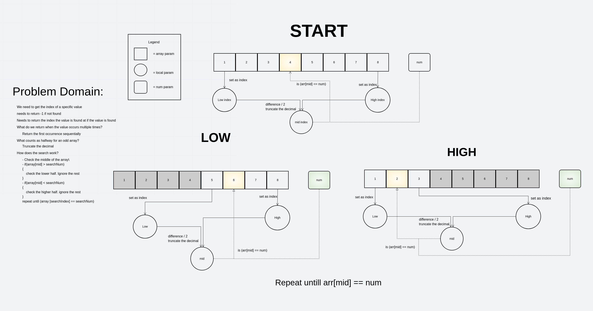

# Binary Search an Array
<!-- Short summary or background information -->
Takes a sorted array and a search term. Returns the index of the first instance of the search term. if the array is empty or doesnt contain the term returns -1.

## Challenge
<!-- Description of the challenge -->
Search an array for a term using the binary method. This involves checking the halfway point of a sorted array then checking if its higher or lower than the search term. Then depending on if the value was high or low it checks the half way point of one half of the array. This repeats until the value is found.

## Approach & Efficiency
<!-- What approach did you take? Why? What is the Big O space/time for this approach? -->
used 3 variables to track the lower search index, the higher search indes, and the middle. using a while loop it loops the halving in the array until it find the value.

The Big O notation for this should be O(log n). Since it requires doubling the size to add one more operation.

I then added the loop that finds the first iteration. This negatively impacts performance for precision. Once the value is found it does a reverse sequencial search until it doesnt find the number again. 

The Big O notation would be O(n).

## Solution
<!-- Embedded whiteboard image -->

