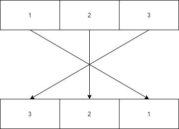

# Reverse an Array
<!-- Short summary or background information -->
Take in an array of integers and return it in reverse order.

## Challenge
<!-- Description of the challenge -->
Same as description

## Approach & Efficiency
<!-- What approach did you take? Why? What is the Big O space/time for this approach? -->
We created a new array object and assigned the values in reverse order. It took less assignments to complete at the cost of higher memory allocation.

The Big O notation for this should be O(n).

## Solution
<!-- Embedded whiteboard image -->

