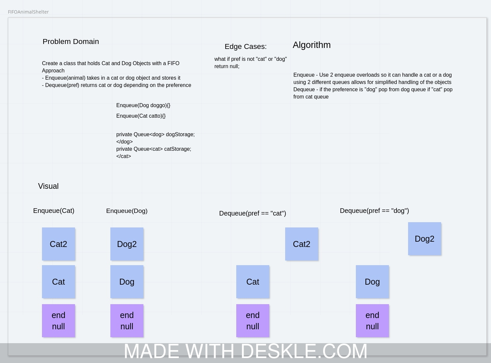

# Challenge Summary
<!-- Short summary or background information -->
Create an "Animal shelter" that uses the FIFO approach to handling cats and dogs.

## Challenge Description
<!-- Description of the challenge -->
How do you support handling multiple types of objects without errors?

## Approach & Efficiency
<!-- What approach did you take? Why? What is the Big O space/time for this approach? -->
I used two queues, one for cats, one for dogs. I used two overloads for enqueue to handle a cat and a dog. Deque uses if conditionals to handle a `"cat"` and `"dog"` string to pass back a popped animal from the correct queue. If you dont pass in dog or cat it returns `null`. Dequeue returns as Object so you have to cast it back to the expected animal type.

## Solution
<!-- Embedded whiteboard image -->

