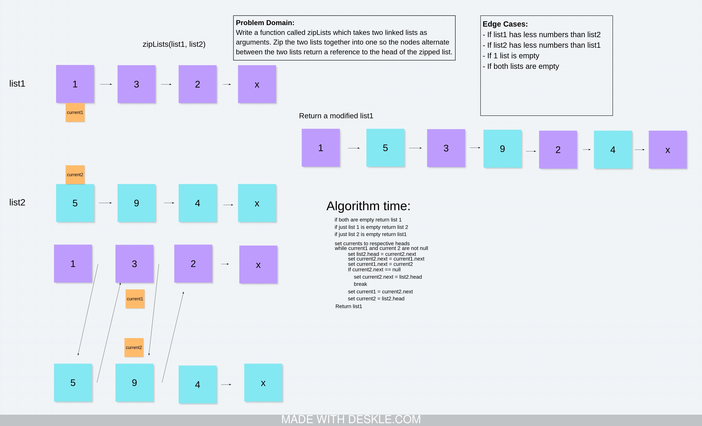

# Zip 2 LinkedLists
<!-- Short summary or background information -->
Preform a zipper merge on 2 linked lists

## Challenge
<!-- Description of the challenge -->
Take in 2 Linked Lists and return list1 with all the values of list2 inserted between the nodes of list1;

## Approach & Efficiency
<!-- What approach did you take? Why? What is the Big O space/time for this approach? -->
Returns `list2` if `list1` is empty. Go through both lists with a current for each and a third Node variable to track the new head of `list2` since Head.set is private. While iterating through we set `list2` nodes.next to the equivilent `list1` nodes.next and the `list1` nodes.next to the equivilent `list1` nodes. If list1 is shorter than list2 add the rest of list 2 onto list1.

Big O notation: space: O(1) time: O(n)

## Solution
<!-- Embedded whiteboard image -->

