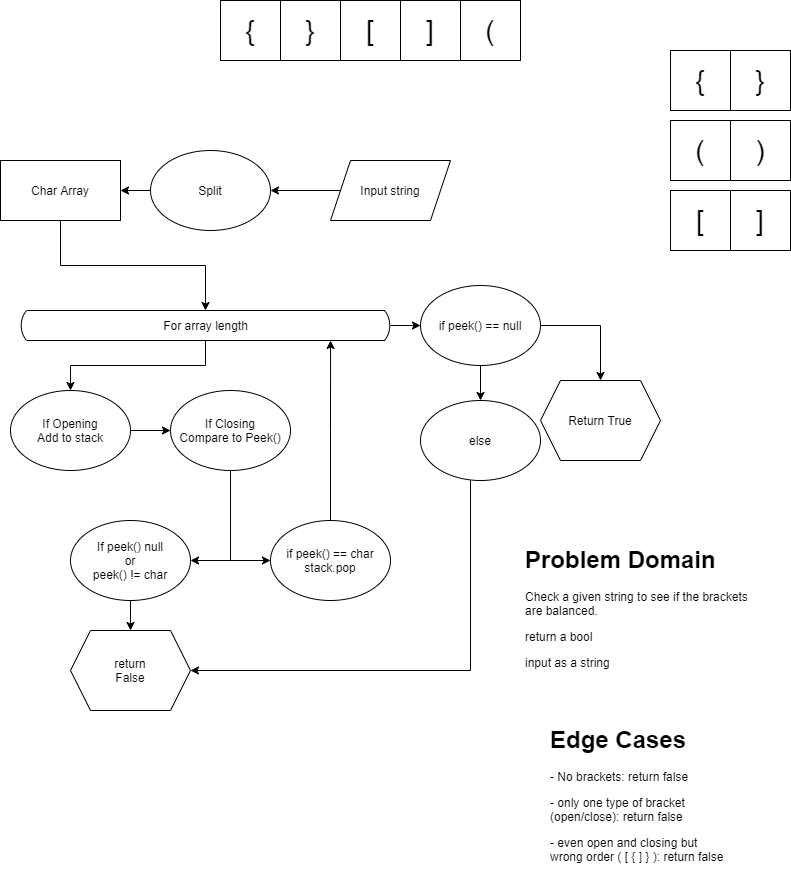

# Challenge Summary
<!-- Short summary or background information -->
Create a method that checks if brackets are balanced.

## Challenge Description
<!-- Description of the challenge -->
Keep track of the last opening bracket to see if the next closing bracket is the same type.

## Approach & Efficiency
<!-- What approach did you take? Why? What is the Big O space/time for this approach? -->
We used a stack of `char` to track the order of opening brackets. Used a foreach on the input string to check each character to see if its a bracket. When a closing bracket comes up compare it to the top of the stack for validation. Had a separate bool to check if the string has any brackets in it.

## Solution
<!-- Embedded whiteboard image -->
