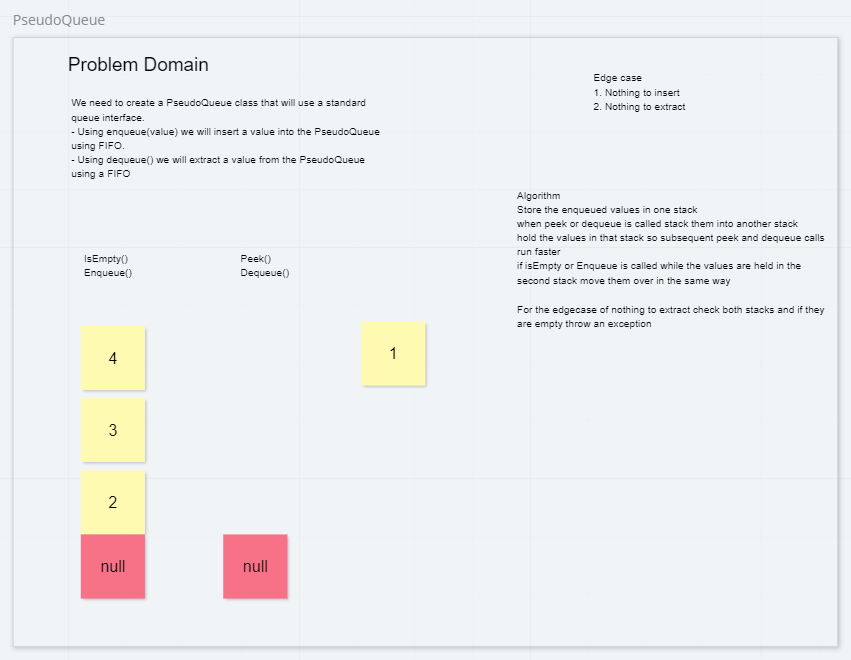

# Challenge Summary
<!-- Short summary or background information -->
Create a Queue with only stacks.

## Challenge Description
<!-- Description of the challenge -->
instead of using a front, end, and nodes use stacks to act like a queue

## Approach & Efficiency
<!-- What approach did you take? Why? What is the Big O space/time for this approach? -->
2 stacks, one for storage and one for holding it reversed
For enqueue just push to storage.
For dequeue and peek pop and push to reversed and then pop or peek.
Use a helper method to reduce time on repeated method calls.

## Solution
<!-- Embedded whiteboard image -->

